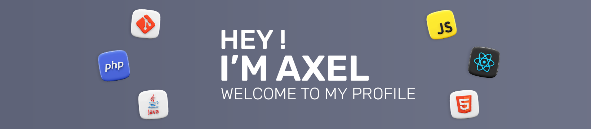

  

<h2 align="center">
👤 About me
</h2>

As a third-year computer science student passionate about technology, I started my journey with VB.net, developing chat applications. This experience fueled my curiosity in various programming languages, aiming to deepen my technical skills. Through a professional apprenticeship and team-based projects, I've focused on sustainable architecture and user-centric design. My goal is to merge innovative design with solid development practices to create impactful solutions.

If you want to know more about me, I invite you to check out my [Portfolio](https://axelfrache.github.io/) 🌐

   

## 🤝 Connect with me

 

## 💼 Technical Skills

 

 

## 📈 Stats

