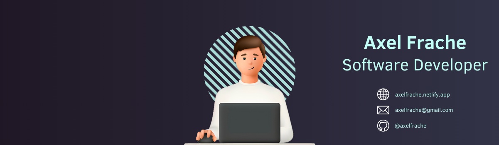

# Hi there, I'm [Axel](https://axelfrache.netlify.app/) 👋

  

<h3 align="center">CS student passionate about development and innovative technology 👨‍💻</h3>

  I'm a third-year computer science student with a deep passion for technology. My journey began with VB.net, where I developed chat applications using sockets. This initial experience sparked my curiosity and led me to explore various programming languages.

  I'm currently working to improve my skills in software architecture and DevOps, areas that greatly interest me. I primarily work with Java, Spring, and JavaScript frameworks like React and Next.js. My goal is to blend innovative design with solid development practices to create impactful solutions.

<h2 align="center">🤝 Connect with Me</h2>

  &nbsp;&nbsp;&nbsp;

<h2 align="center">💼 Technical Skills</h2>

  
  
  
  
  
  

  
  
  
  
  

  
  
  
  

<h2 align="center">📈 Stats</h2>

  

  

